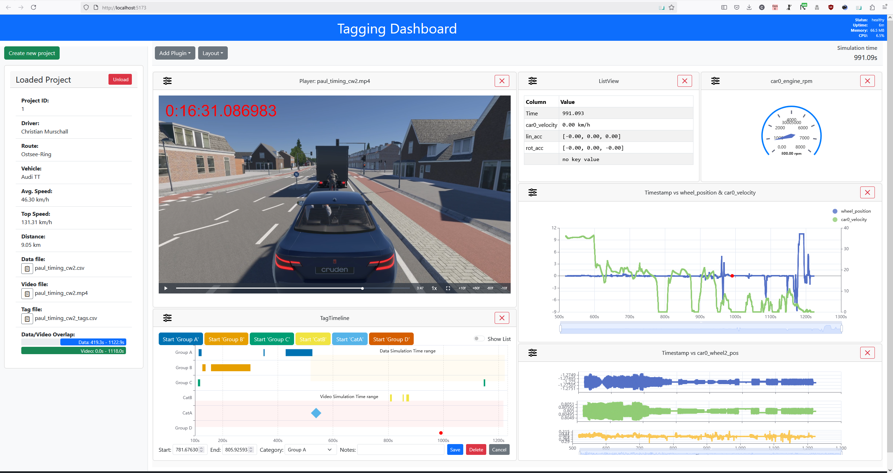
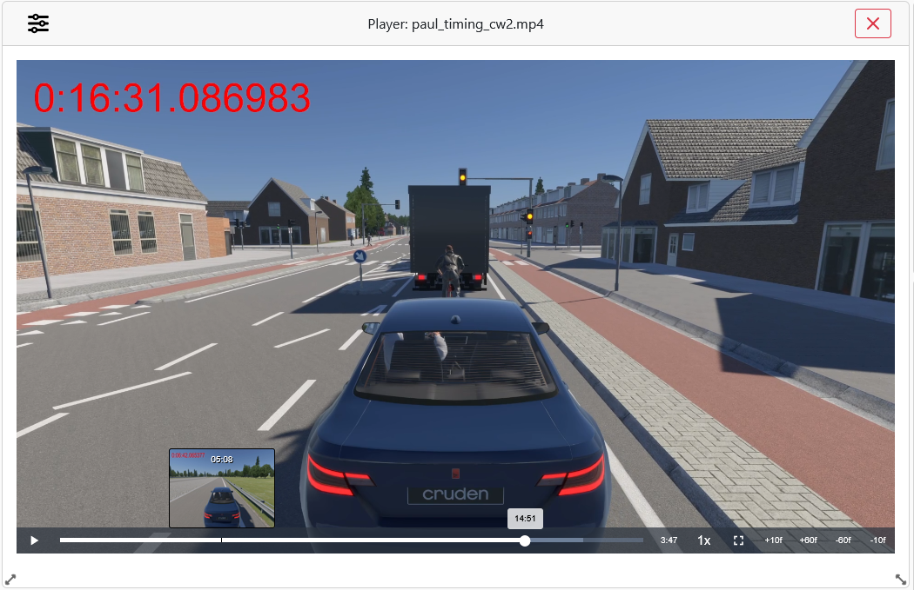
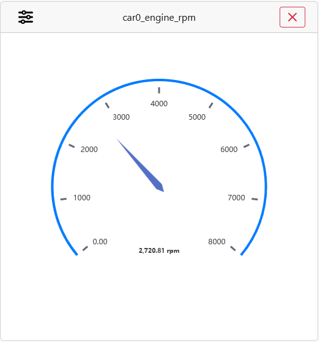
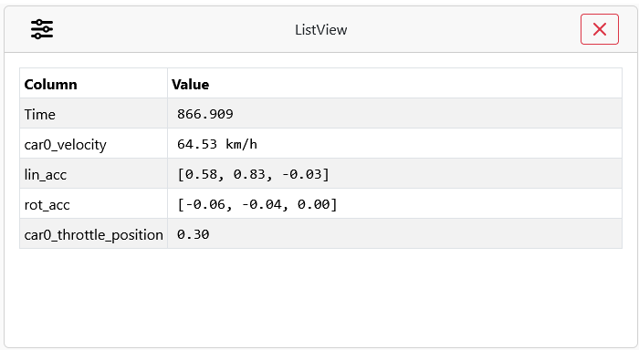
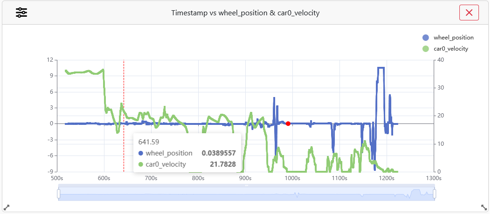
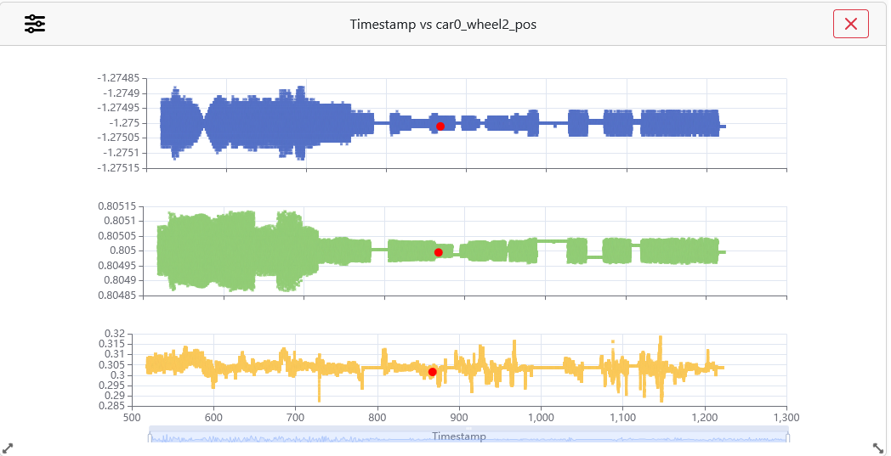
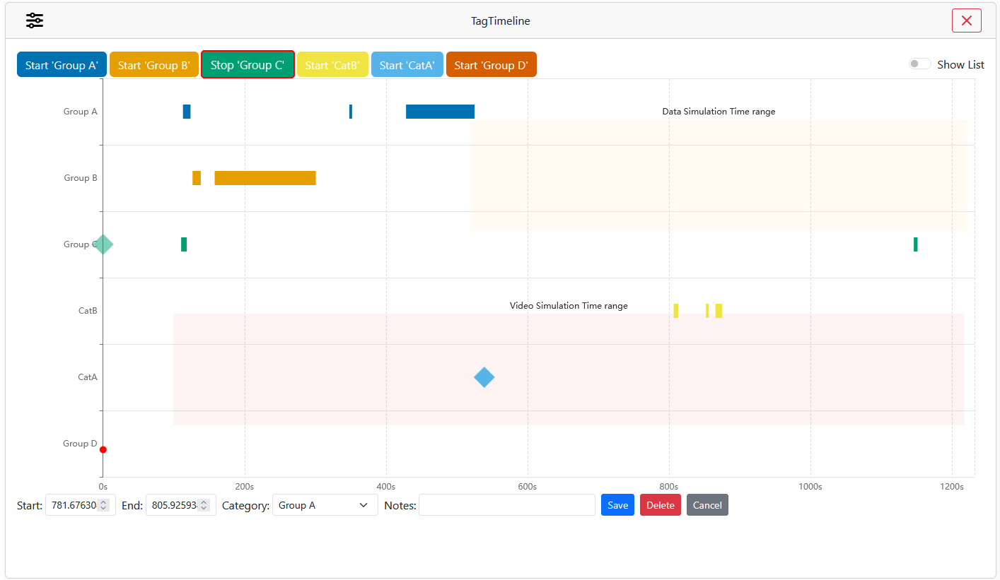
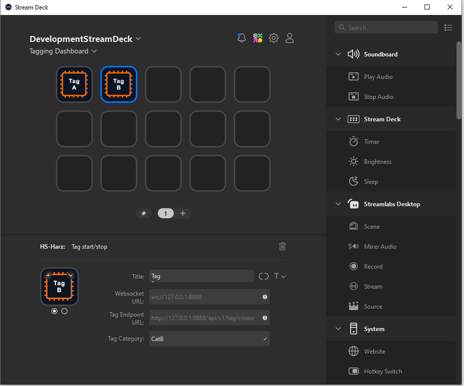

# Tagging Dashboard

**Tagging Dashboard** is a web-based application built with **FastAPI (Python)** on the backend and **Vue 3 + TypeScript
** on the frontend. It is designed for **interactive tagging of simulation or measurement data**, including synchronized
video playback, live data streams, plugin-based visualizations, and real-time updates.




---

## ️ Development Setup

### Backend (FastAPI)

Python 3.11.3 or higher is required. Creation of a virtual environment and installation of dependencies:

```powershell
# Create a virtual environment
python -m venv venv

# On Windows (cmd.exe)
venv\Scripts\activate.bat
# On Windows (PowerShell)
venv\Scripts\Activate.ps1
# On Linux/macOS (bash/zsh)
source venv/bin/activate

# Install dependencies
pip install -r requirements.txt
```

You need a FFmpeg installation to create the video previews. You can download it from the official
website: [FFmpeg](https://ffmpeg.org/download.html). Make sure to add the FFmpeg binary to your PATH environment
variable. You can check if FFmpeg is installed correctly by running the following command in your terminal:

```powershell
ffmpeg -version
```

You should at least see version 7.0.1 or higher. FFmpeg is used to create the video previews and for other video file
manipulations.

The backend can be started with:

```powershell
 python.exe -m uvicorn app.main:app --reload --port 8888 --log-level debug
```

API Docs available at: [http://localhost:8888/docs](http://localhost:8888/docs)

### Frontend (Vue 3 + TypeScript)

As the frontend is a Vue 3 application, you need to have Node.js and npm installed. You can download them from the
official website: [Node.js](https://nodejs.org/). After installing Node.js, you can check if it is installed correctly
by running the following commands in your terminal:

```powershell
node -v
```

Node.js 21.6.1 or higher is required.

The frontend uses a generated OpenAPI client to communicate with the backend. The client is generated using
the [generateTypscriptRestClient.py](generateTypscriptRestClient.py) script. This script uses the OpenAPI specification
generated by FastAPI to create a TypeScript client that is used in the frontend application. If the backend changes this
script must be re-run.

From the project's root directory, generate the client with:

```powershell
python generateTypscriptRestClient.py
```

This will also generate an `openapi.json` file. This file contains the OpenAPI specification for the backend and can be
imported by many tools like Postman to test the API.

Switch to the frontend directory (`app.ui`) and install the dependencies:

```powershell
npm install
```

To fire up a development server, run:

```powershell
npm run dev
```

To build the frontend for production, run:

```powershell
# Build the frontend for production with type checking
npm run build

# Build the frontend for production without type checking
npm run build:fast
```

After building the frontend, you can find the production files in the `app\static` directory. This is the directory that
is served by the FastAPI backend.

There is also a PyInstaller spec to create a standalone executable for the application. Make sure you have PyInstaller
installed.

```powershell
pip install pyinstaller
```

Then run the following command to create the executable:

```powershell
pyinstaller --clean tagging_dashboard.spec
```

This will create a `dist` directory with the executable and all the necessary files to run the application. It is
recommended to run the generated executable from a command line to see the output and error log messages.

### Installer

There is a There is a [tagging_dashboard.spec](tagging_dashboard.spec) PyInstaller spec file in the root directory that
will pack the project into a windows executable.
To build the executable pyinstaller in version 6.13.0 or greater is required
Run

```powershell
pyinstaller --clean tagging_dashboard.spec
```

and the resulting `tagging_dashboard.exe` file will be output in the `dist` directory. This method is not well tested (
the testing method was: "Oh wow, now it finally builds a .exe file and fires up without errors and serves the webpage.") and it is highly
recommended to run the executable from commandline to see any errors on stdout and stderr that might occur.

### Streamdeck  Plugin

To build the Streamdeck plugin you need to have
the [Streamdeck SDK](https://docs.elgato.com/streamdeck/sdk/introduction/getting-started) installed. You can download it
from the official website. After installing the SDK, you can build the plugin with the following command inside of the
`\streamdeck` directory:

```powershell
npm install

npm run bundle
```

This will create a `de.hs-harz.fahrsimulator-tagger.streamDeckPlugin` file that can be installed in the Streamdeck
software by a simple double click.

If you plan to develop the plugin further, you should first link the output directory to the Streamdeck plugin folder:

```powershell
npm run link
```

you can then start a development server that will watch for changes in the plugin directory and automatically rebuild
the plugin when changes are detected. To start the development server, run:

```powershell
npm run watch
```

## Usage

### Setup

There is a [settings.py](app/settings.py) file in the `app` directory. This file contains the configuration for the
application. Change the path settings according to your needs:

- `TAG_PATH` : The output directory for the generated tagging files.
- `CSV_PATH` : The path to the CSV files that are output by the pantheras logger.
- `VIDEO_PATH`: The path to the video files that are output by the pantheras video steam.
- `SPRITE_FOLDER` : This is the folder where the backend stores the generated sprites that are used for displaying
  preview
  images of the video files.
- `CSV_UPLOAD_DIR` : This is the path where user uploaded CSV files are stored.
- `VIDEO_UPLOAD_DIR` : This is the path where user uploaded video files are stored.

If you are planing on using this project on the internet you should reconsider the CORS rules. At the moment they are
all open. This is not recommended for production use. You can change the CORS settings in the [main.py](app/main.py)
file.

## Plugin-Components

### Video


The video player is built using the [video.js](https://videojs.com/) library. It provides a custom video player with
thumbnail previews and frame-accurate controls, tailored for simulation playback and data synchronization. This
component acts as the main source of simulation time clock. The video time is mapped to a simulation time via
pluginService. When synchronized:

- Data visualizations (like gauges or charts) update in real time.
- Seeks are clamped to valid video bounds.

The input is the video file path, from the loaded project. At the moment we only support one video file per project. The
player supports thumbnail previews, which are generated by the backend. It allows for frame-by-frame navigation (±1s,
±10 frames) which could be adjusted in the code easily. The component also supports various playback speeds.

### Gauge



This Vue 3 component displays a real-time gauge chart based on a selected numeric column from timeseries data. It
supports live updates, flexible configuration, and MathJS transformations.

It supports the following adjustable parameters:

- Column: Dropdown with numeric columns from the loaded project csv file
- Min / Max: Gauge range
- Splits: Number of segments
- Color: Gauge color (HTML color input)
- Formatter: Format string (e.g. `{value:F1}`)
- Converter: MathJS expression (e.g. `value * 2`)

### Data list



A dynamic list that displays selected timeseries values in real time, with per-column formatting and conversion options.
This component has no limits what data to display. It supports scalar values as well as arrays. The data is displayed in
a table format, with each row representing a different column from the loaded project csv file. The component supports
live updates and allows for custom formatting and conversion of the displayed values.

It supports the following adjustable parameters:

- For each row:
    - Data column: Choose a numeric or array column
    - Detail formatter: Format value display
    - Math converter: Apply transformation via MathJS

### Scatter Plot (non-live)



This component displays a scatter plot of timeseries data, with support for two Y-axes and customizable MathJS-based
value transformations. The current simulation point is marked with a red circle. It supports updating the simulation
time by clicking into the desired point in the plot. The plot also supports zooming and panning, allowing for more
detailed analysis of the data. The component is designed to work with large datasets and can handle many thousands of
points without any performance issues. Only numeric columns can be selected.

It supports the following adjustable parameters:

- Select Y-axis columns (left & right)
- Enter transformation expressions for each Y-axis (`value`, `value * 3.6`, etc.)

### Vector Plot (non-live)



Displays each component of a vector timeseries as a separate scatter plot, stacked vertically and synchronized on the
time axis. Only vector/object columns are available for selection. The current simulation point is marked with a red
circle. It supports updating the simulation time by clicking into the desired point in the plot. The plot also supports
zooming and panning, allowing for more detailed analysis of the data. The component is designed to work with large
datasets and can handle many thousands of points without any performance issues. Only numeric columns can be selected.

It supports the following adjustable parameters:

- Select Column: Choose a vector data column (e.g. acceleration, orientation)

### Tag Timeline



The TagTimeline component enables users to create, visualize, and manage timeline-based tags, each associated with a
category. It is ideal for synchronized simulation or video playback scenarios, supporting real-time tagging, custom
editing, and interactive visualization.

Tags can be created using a simple start/stop mechanism and are displayed in a responsive timeline chart as colored bars
or markers. Tags are fully editable — including start/end times, category, and notes — and a tabular list view supports
quick inspection and selection. Real-time WebSocket integration ensures new tags appear instantly as they are received.

The component supports two primary modes:

- Tag Category Management
    - Add new categories by entering a name and clicking Add
    - Delete existing categories from the list
    - Each category is assigned a distinct color automatically

- Tag Interaction Mode
    - Category buttons allow starting/stopping tag recording during playback
    - Tags are shown in a timeline chart, with support for:
    - Clicking to edit, delete, or seek playback
    - Viewing a live red highlight marker for current time
    - Toggle Show List to view all tags in a sortable, clickable table

When a tag is being created (recording):

- A "floating" tag is added and grows in real time
- Stopping the recording finalizes and saves the tag to the backend

It supports the following adjustable parameters:

- Add a new tag category by entering a name and clicking Add
- Delete existing categories from a list
- Colors are automatically assigned for visual differentiation

## Building own component plugins

This is a highlight of this project! The application is designed to be extensible, allowing developers to create
comprehensive custom components that can be added to the web application.

To build your own component, you need create a new folder with your plugin name into  `app.ui/plugins/` directory.
Inside of this folder you need to create a `manifest.json` file. This file contains the metadata for your plugin. It
should look like this:

```json
{
  "id": "pluginId",
  "name": "Display name of the plugin",
  "entry": "plugin.js",
  "version": "1.0.0",
  "description": "A short description of the plugin",
  "defaultSize": {
    "width": 5,
    "height": 5
  }
}
```

Your plugin can be written in TypeScript or JavaScript. The entry point should have a default export of of this
TypeScript interface:

```typescript
interface TaggingDashboardPlugin {
    create: (container: HTMLElement, pluginService: PluginServices) => void;
    onMounted?: () => void;
    onUnmounted?: () => void;
}
```

The `create` method is called when the plugin is loaded. The `container` parameter is the HTML element where the plugin
is mounted. The `pluginService` parameter is an object that contains an interop to the main application. It is used to
communicate with the main application and to access the data and methods of the application. The `onMounted` and
`onUnmounted` methods are called when the plugin is mounted or unmounted.

The plugin service exposes the following interface:

```typescript
interface PluginServices {
    // returns the assigned plugin id
    getId: () => string;

    // an observable that the plugin can subscribe to and show an option menu
    showMenu$: Observable<boolean>;
    // a function to set the title of the card
    cardTitle$: Observable<string>;

    // an observable to receive the current simulation time
    simulationTime: Observable<number>;

    // function to get the current loaded project
    getProjectInfo: () => TestDriveProjectInfo | undefined;

    // function to get the current data manager. This allows to request data columns and receive updates about the current next data point to show
    getDataManager: () => DataManager,

    // function to display a toast message
    showToast: ShowToastFn;

    // can be used to save the current settings of the plugin. Saved settings are available when a layout is restored via the getPluginState function
    savePluginState: (state: Record<string, any>) => void;
    getPluginState: () => Record<string, any> | undefined;

    // the returned VideoControl can be used to update the current video time via the seekTo function. If your plugin wants to pick up the seekTo Messages from other plugins you can set the setSeekTo. This will override the current seekTo messages.
    getVideoControl: () => VideoControl;
}
```

The added plugins are built and copied into the output folder with

```powershell
npm run build:plugins
```

A sample plugin is available in the plugin folder of the `app.ui` directory.

## The Streamdeck plugin

The Streamdeck plugin allows you to add new Tags to the tagging dashboard from your streamdeck.



It has two possible action buttons:

- Add an instant tag: This action adds a tag to the current time of the video. The tag is created with the current
  simulation time for the start and end time.
- Add a tag with a duration: This action adds a tag to the current time of the video. This action has two states: When
  pressed once the current simulation time is used for the start time of the tag. When pressed again the current
  simulation time is used for the end time of the tag.

Button setup:

- Websocket URL: The URL of the websocket server where the plugin is informed about the current simulation time. This is
  usually `ws://127.0.0.1:8888/api/v1/ws/simulationTime`
- Tag Endpoint URL: The URL of the tagging post endpoint. This is usually `http://127.0.0.1:8888/api/v1/tag/create`
- Tag Category: The category of the tag. This is the name of the category that is used in the tagging dashboard.